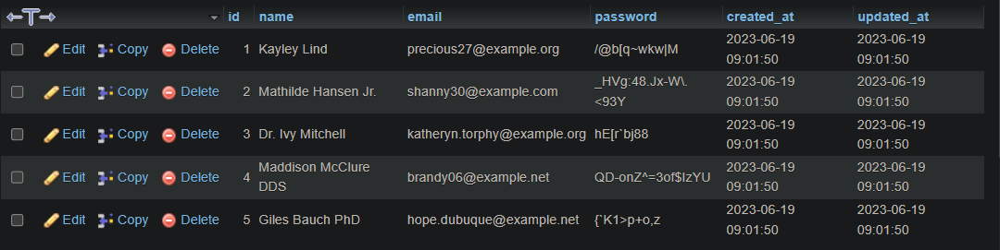

# Prepare connection, model, and dto

What we should prepare before starting to use the project is :

### Database

-   Create database named `dumbmerch`

### Connect database to laravel app

-   Open your `.env` file, if it's not there, copy the `.env.example`, and rename it as `.env`
-   Then, configure your `.env` file like this (if you using mysql), or configure it as your other used database provider.

```env
DB_CONNECTION=mysql
DB_HOST=127.0.0.1
DB_PORT=3306
DB_DATABASE=dumbmerch
DB_USERNAME=root
DB_PASSWORD=
```

### Delete unused file

When you create first laravel project, it has some template file that is already made, delete this file **(we recommend just delete the file inside it, not the folder)** :

-   `app/Models/User.php` (or, all files inside `Models` folder)
-   `database/factories/UserFactory.php` (or, all files inside `factories` folder)
-   `database/migrations/*` (or, all inside `migration` folder)

Even we're trying to make the `User` again after this, we'll try to make at from start so you can understand.

### Automatically generate model, migration, controller, factory, and seeder

You can type this in your terminal (shorthand version) :

```bash
php artisan make:model -mcfs
```

or (long version)

```bash
php artisan make:model User --migration --controller --factory --seed
```

as you see, laravel automatically creating this file :

-   `app/Models/User.php`
-   `database/factories/UserFactory.php`
-   `database/migrations/your_date_create_users_table.php`
-   `database/seeders/UserSeeder.php`

simple explanation :

-   `Model`: A model is a representation of a database table in code. It helps you interact with data in that table.
-   `Migration`: A migration is a way to change the structure of the database. It lets you create, modify, or delete tables and columns.
-   `Controller`: A controller is a way to handle requests and return responses. It's where you put your application's logic.
-   `Factory`: A factory is a way to create fake data. It helps you write automated tests.
-   `Seed`: A seed is a way to populate your database with initial data. It helps you get started with your application.

### Setup migration

-   Open your `User` migration file, setup your table schema to be like this :

    > File : database/migrations/your_date_create_users_table.php

    ```php
    public function up()
    {
    Schema::create('users', function (Blueprint $table) {
        $table->id();
        $table->string("name");
        $table->string("email")->unique();
        $table->string("password");
        $table->timestamps();
    });
    }
    ```

### Setup factory

-   Open your `User` factory file, setup your fake data definition to be like this :

    > File : database/factories/UserFactory.php

    ```php
    public function definition()
    {
        return [
            'name' => fake()->name(),
            'email' => fake()->unique()->safeEmail(),
            'password' => fake()->unique()->password()
        ];
    }
    ```

### Setup seeder

-   Open your `User` seeder file, setup your code like this :

    > File : database/seeders/UserSeeder.php

    ```php
    public function run()
    {
        \App\Models\User::factory()->count(5)->create();
    }
    ```

    It will be generate 5 data generated from factory

-   Open your `DatabaseSeeder.php` file, and call the UserSeeder like so :

    > File : database/seeders/DatabaseSeeder.php

    ```php
    public function run()
    {
        $this->call(UserSeeder::class);
    }
    ```

### Let's try to migrate!

Run this in your beloved terminal :

```bash
php artisan migrate --seed
```

or

```bash
php artisan migrate:fresh --seed
```

`migrate:fresh`, means that you will automatically delete all your table, and migrate it again from scratch.

Result in phpmyadmin :



### Setup DTO

A Data Transfer Object (DTO) is a simple PHP class that is used to transfer data between different parts of your application. DTOs are often used to encapsulate data that is retrieved from a database or an external API, and then pass that data to another part of your application.

-   Create manually, folder named `DTO` inside `app/` folder
-   Then, inside DTO folder make this structure :

```txt
app/
└── DTO/
    ├── Request/
    │   └── User/
    │       ├── CreateUserRequest.php
    │       └── UpdateUserRequest.php
    └── Response/
        └── User/
            ├── UserResponse.php
            Result/
            ├── SuccessResponse.php
            └── ErrorResponse.php
```

-   Write `SuccessResponse.php` :

    > File : app/DTO/Response/Result/SuccessResponse.php

    ```php
    <?php

    namespace App\DTO\Response\Result;

    class SuccessResponse
    {
        public int $code;
        public mixed $data;

        public function __construct(int $code, mixed $data)
        {
            $this->code = $code;
            $this->data = $data;
        }

        public function toArray(): array
        {
            return [
                'code' => $this->code,
                'data' => $this->data,
            ];
        }
    }
    ```

-   Write `ErrorResponse.php` :

    > File : app/DTO/Response/Result/ErrorResponse.php

    ```php
    <?php

    namespace App\DTO\Response\Result;

    class ErrorResponse
    {
        public int $code;
        public mixed $message;

        public function __construct(int $code, mixed $message)
        {
            $this->code = $code;
            $this->message = $message;
        }

        public function toArray(): array
        {
            return [
                'code' => $this->code,
                'message' => $this->message,
            ];
        }
    }
    ```

-   Write `UserResponse.php` :

    > File : app/DTO/Response/User/UserResponse.php

    ```php
    <?php

    namespace App\DTO\Response\User;

    class UserResponse
    {
        public int $id;
        public string $name;
        public string $email;

        public function __construct(array $user)
        {
            $this->id = $user["id"];
            $this->name = $user["name"];
            $this->email = $user["email"];
        }

        public function toArray(): array
        {
            return [
                'id' => $this->id,
                'name' => $this->name,
                'email' => $this->email,
            ];
        }
    }
    ```

-   Write `CreateUserRequest.php` :

    > File : app/DTO/Response/Result/ErrorResponse.php

    ```php
    <?php

    namespace App\DTO\Request\User;

    use Illuminate\Support\Facades\Validator;

    class CreateUserRequest
    {
        public string $name;
        public string $email;
        public string $password;

        public function __construct(array $user)
        {
            $this->name = $user["name"] ?? "";
            $this->email = $user["email"] ?? "";
            $this->password = $user["password"] ?? "";
        }

        public function validate(): array
        {
            $validator = Validator::make([
                'name' => $this->name,
                'email' => $this->email,
                'password' => $this->password,
            ], [
                'name' => ['required', 'string', 'max:255'],
                'email' => ['required', 'email', 'unique:users,email'],
                'password' => ['required', 'string', 'min:4'],
            ]);

            if ($validator->fails()) {
                $errors = $validator->errors()->toArray();
                return [
                    'error' => $errors,
                ];
            }

            return [];
        }
    }
    ```

-   Write `UpdateUserRequest.php` :

    > File : app/DTO/Response/Result/ErrorResponse.php

    ```php
    <?php

    namespace App\DTO\Request\User;

    use Illuminate\Support\Facades\Validator;

    class UpdateUserRequest
    {
        public string $name;
        public string $email;
        public string $password;

        public function __construct(array $user)
        {
            $this->name = $user["name"] ?? "";
            $this->email = $user["email"] ?? "";
            $this->password = $user["password"] ?? "";
        }

        public function validate(): array
        {
            $validator = Validator::make([
                'name' => $this->name,
                'email' => $this->email,
                'password' => $this->password,
            ], [
                'name' => ['nullable', 'string', 'max:255'],
                'email' => ['nullable', 'email', "unique:users,email"],
                'password' => ['nullable', 'string', 'min:4'],
            ]);

            if ($validator->fails()) {
                $errors = $validator->errors()->toArray();
                return [
                    'error' => $errors,
                ];
            }

            return [];
        }
    }
    ```

-   Okay, it's done now, after this you could create something more interesting 🔥
