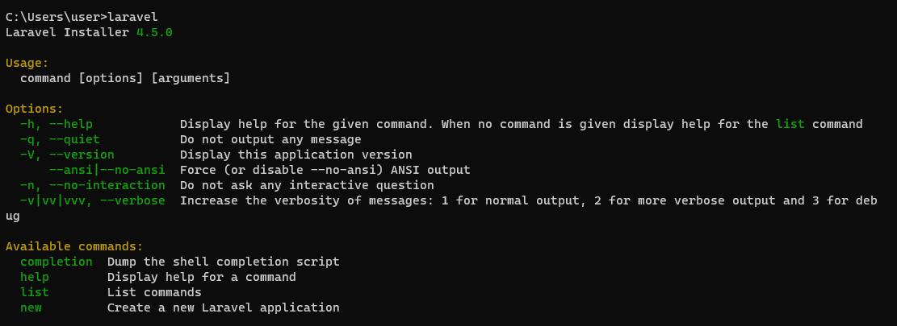
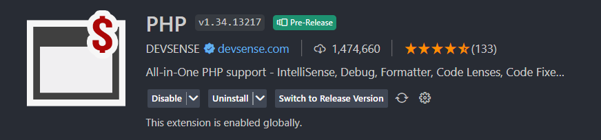
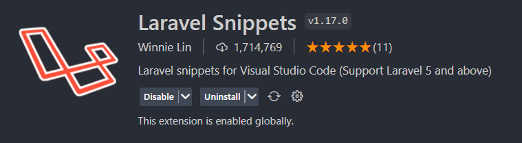

# Prepare

### 1. Download

- Composer [Click Here](https://getcomposer.org/download/)
- XAMPP: [Click Here](https://www.apachefriends.org/download.html)
- Postman: [Click Here](https://www.postman.com/downloads/?utm_source=postman-home)

#### PREFERENCE :
You can also use laravel installer :
```bash
composer global require laravel/installer
```

Check if it's installed :
Open cmd -> type **"laravel"**

If it's show like this, it's ready to go! 🔥 :




### 2. Extension on VS Code



PHP Extension [Click Here](https://marketplace.visualstudio.com/items?itemName=DEVSENSE.phptools-vscode)



Laravel Extension [Click Here](https://marketplace.visualstudio.com/items?itemName=onecentlin.laravel5-snippets)
