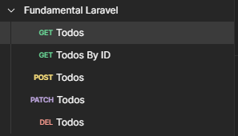

# Routing

In Laravel, routing is pretty easy and straightforward. It is essential to have a solid understanding of REST API principles, including the utilization of HTTP methods like GET, POST, PATCH, DELETE, etc.

API, which stands for Application Programming Interface, acts as an interface that connects one application with another. It serves as a mediator between different applications, whether they are within the same platform or across multiple platforms.

-   Firstly, make `todos.json` in `root directory` like so :

> File : `todos.json`

```json
[]
```

-   For now, you can revise the code you previously wrote in `routes/api.php`

> File : `routes/api.php`

-   Package :

```php
use Illuminate\Http\Request;
use Illuminate\Support\Facades\Route;
```

-   Create routes :

```php
Route::get('/todos', [TodoController::class, 'findTodos']);
Route::get('/todos/{id}', [TodoController::class, 'getTodo']);
Route::post('/todos', [TodoController::class, 'createTodo']);
Route::patch('/todos/{id}', [TodoController::class, 'updateTodo']);
Route::delete('/todos/{id}', [TodoController::class, 'deleteTodo']);
```

-   Create TodoController class :

```php
class TodoController
{
// all todo controller stored here...
}
```

-   Inside `TodoController` insert this code :

```php
private $todosFile;

public function __construct() {
    $this->todosFile = base_path("/todos.json");
}
```

This is for storing `todos.json` file path so we can use it later

-   Create `findTodos` method :

```php
public function findTodos()
{
    $todos = json_decode(file_get_contents($this->todosFile));

    return response()->json([
        'message' => $todos
    ]);
}
```

-   Create `getTodo` method :

```php
public function getTodo($id)
{
    $todo = null;
    $isGetTodo = false;

    $todos = json_decode(file_get_contents($this->todosFile));

    foreach ($todos as $item) {
        if ($id === $item->id) {
            $isGetTodo = true;
            $todo = $item;
            break;
        }
    }

    if (!$isGetTodo) {
        return response()->json([
            "code" => 404,
            "message" => "ID : $id not found"
        ], 404);
    }

    return response()->json($todo);
}
```

-   Create `createTodo` method :

```php
public function createTodo(Request $request)
{
    $todos = json_decode(file_get_contents($this->todosFile));

    $todo = [
        'id' => $request->id,
        'title' => $request->title,
        'isDone' => false
    ];

    array_push($todos, $todo);

    file_put_contents($this->todosFile, json_encode($todos));

    return response()->json([
        "code" => 201,
        'message' => 'Todo created successfully'
    ]);
}
```

-   Create `updateTodo` method :

```php
public function updateTodo(Request $request, $id)
{
    $data = $request->json()->all();
    $isGetTodo = false;

    $todos = json_decode(file_get_contents($this->todosFile));

    foreach ($todos as $index => $item) {
        if ($id === $item->id) {
            $isGetTodo = true;
            $todos[$index] = $data;
            break;
        }
    }

    if (!$isGetTodo) {
        return response()->json([
            "code" => 404,
            "message" => "ID : $id not found"
        ], 404);
    }

    file_put_contents($this->todosFile, json_encode($todos));

    return response()->json($data);
}
```

-   Create `deleteTodo` method :

```php
public function deleteTodo($id)
{
    $isGetTodo = false;
    $index = 0;

    $todos = json_decode(file_get_contents($this->todosFile));

    foreach ($todos as $idx => $item) {
        if ($id === $item->id) {
            $isGetTodo = true;
            $index = $idx;
            break;
        }
    }

    if (!$isGetTodo) {
        return response()->json([
            "code" => 404,
            "ID : $id not found"
        ], 404);
    }

    array_splice($todos, $index, 1);
    file_put_contents($this->todosFile, json_encode($todos));

    return response()->json([
        "code" => 204,
        'message' => 'Todo deleted successfully'
    ]);
}
```

### Postman Structure

You can structure your Postman request like this:

